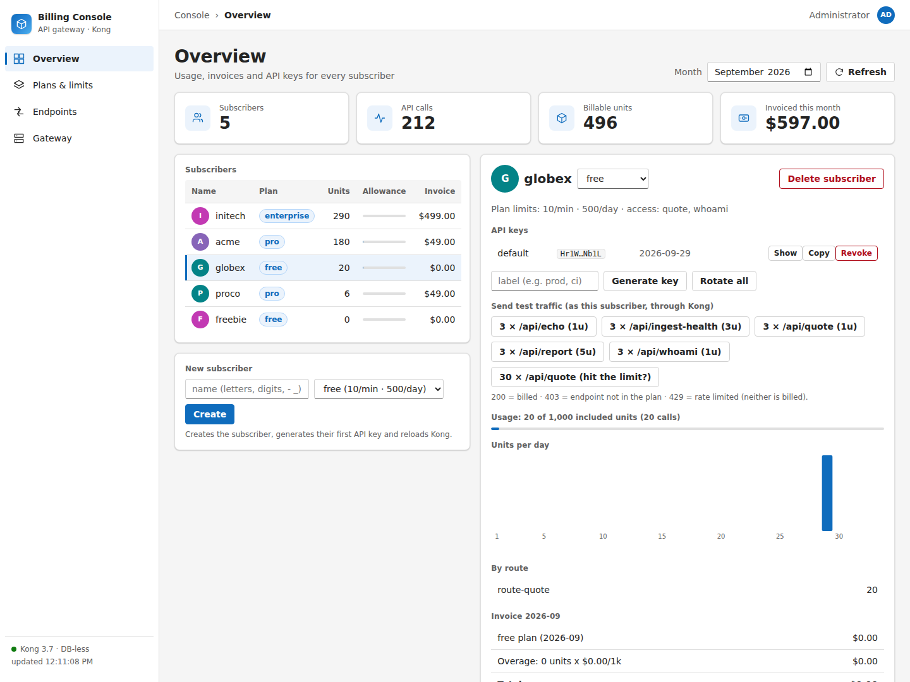
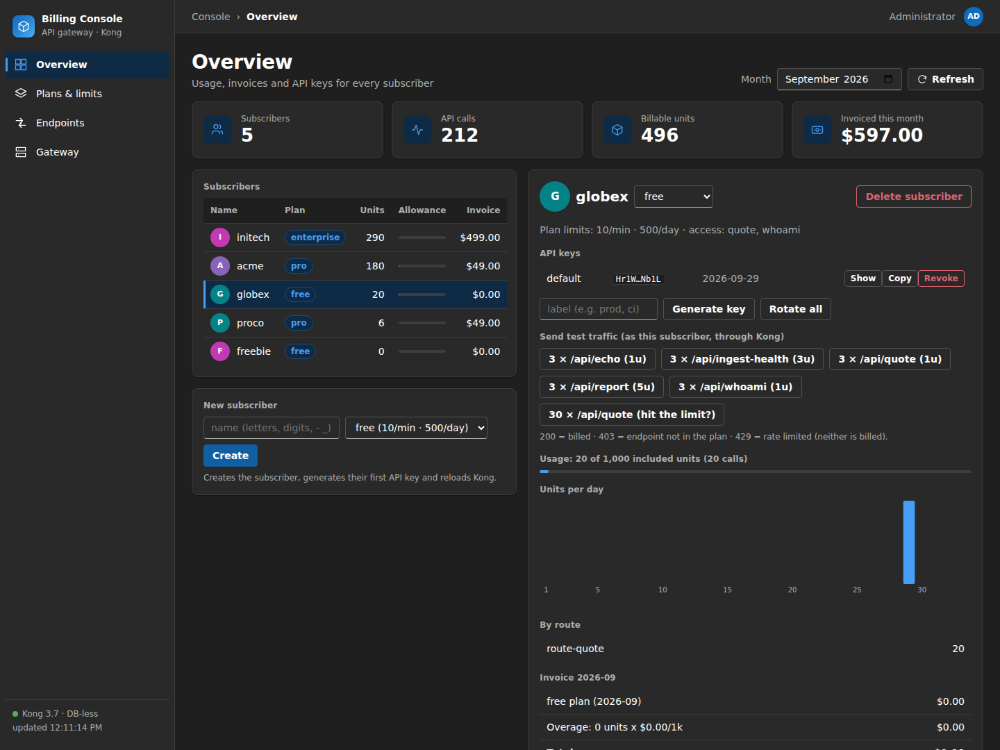
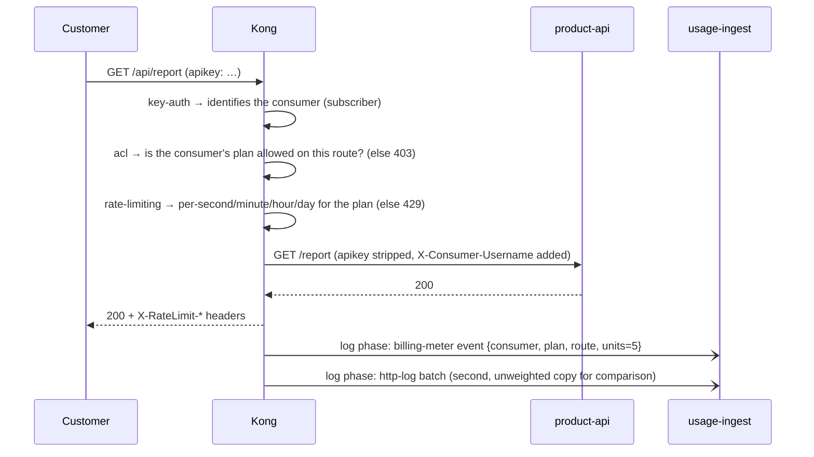
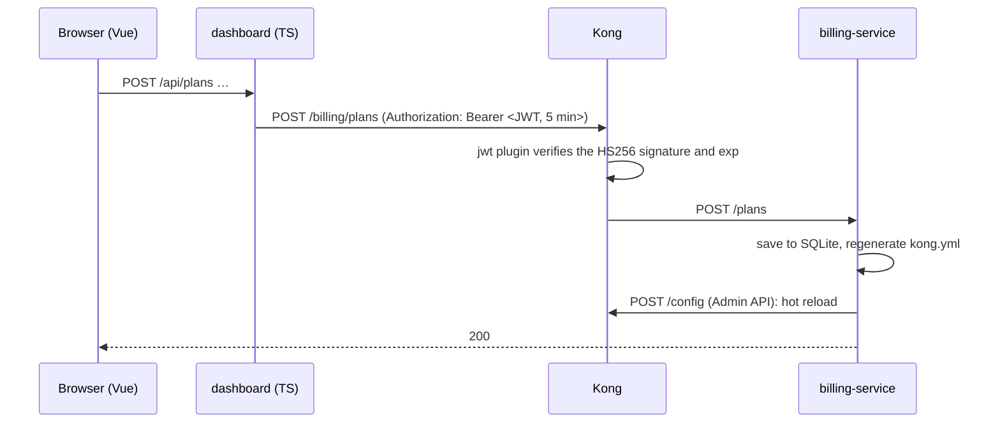
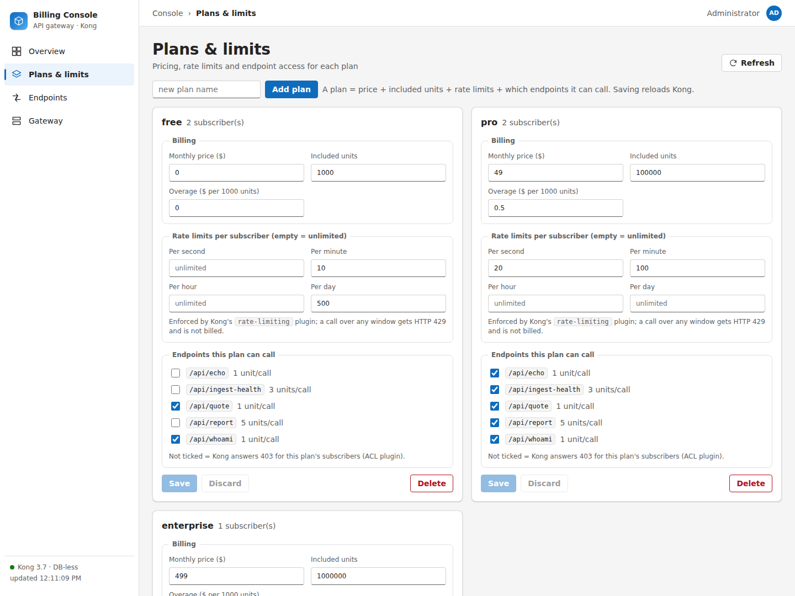
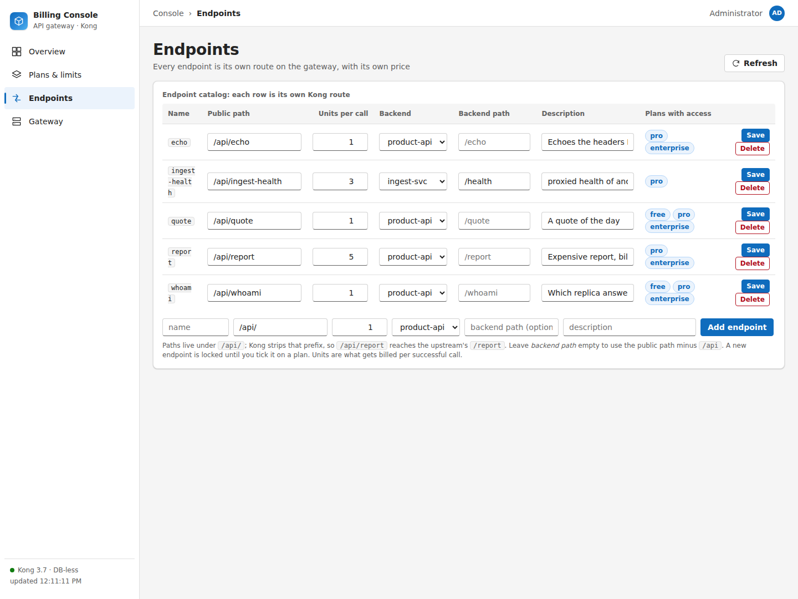
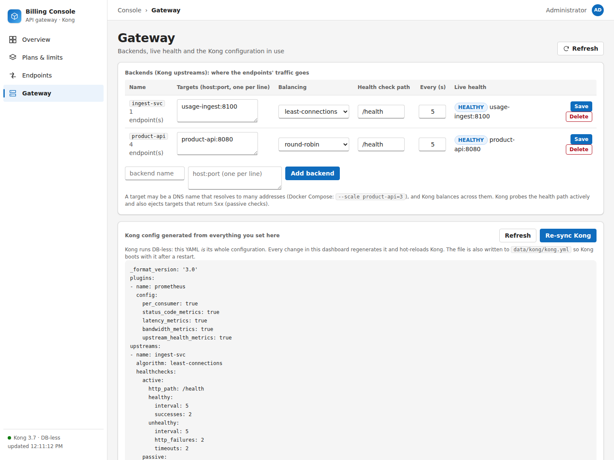
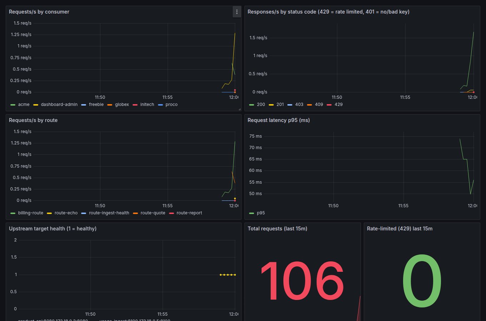

# kong-api-gateway: an API billing system built around Kong

A working API-monetisation stack you can run on a laptop, built to **learn Kong as an API gateway** by
using it for something real: customers get API keys and plans, Kong enforces who may call what and how
fast, every billable call is metered, and an invoice falls out at the end of the month.

**Everything is managed from a web dashboard.** Subscribers, API keys, plans, rate-limit rules, which
endpoints each plan can call, the endpoints themselves, and even the backend services Kong routes to are all
created and edited in the UI. No code change, config edit or restart is needed.



<sub>The dashboard follows your OS theme. Dark mode:</sub>



| | |
|---|---|
| **Gateway** | Kong 3.7 in **DB-less** mode (config is a generated YAML file), plus one **custom Lua plugin** |
| **Python** | FastAPI: `billing-service` (the brain) and `product-api` (a sample billable API) |
| **TypeScript** | `usage-ingest` (metering) and `dashboard` (UI, with Vue 3 loaded from a CDN) |
| **Observability** | Prometheus + a provisioned Grafana dashboard |
| **Run it** | Docker Compose, one command |

---

## Contents

1. [Quick start](#1-quick-start)
2. [Architecture](#2-architecture)
3. [Where the data lives](#3-where-the-data-lives)
4. [Managing everything from the UI](#4-managing-everything-from-the-ui)
5. [How billing works](#5-how-billing-works)
6. [Kong concepts: where each one is used](#6-kong-concepts-where-each-one-is-used)
7. [Experiments to try](#7-experiments-to-try)
8. [The custom Lua plugin](#8-the-custom-lua-plugin)
9. [Observability](#9-observability)
10. [API reference](#10-api-reference)
11. [Configuration](#11-configuration)
12. [Security notes](#12-security-notes)
13. [Development and testing](#13-development-and-testing)
14. [Troubleshooting](#14-troubleshooting)
15. [Known limitations](#15-known-limitations)

---

## 1. Quick start

**You need:** Docker with Compose v2. (For running the tests outside Docker: Python 3.11, Node 22, Lua 5.1.)

```bash
make up        # builds and starts everything (first build takes a few minutes)
make demo      # creates three subscribers and sends realistic traffic
```

Then open the dashboard: **http://localhost:3000**

| URL | What |
|---|---|
| http://localhost:3000 | **Dashboard**: manage everything, see usage and invoices |
| http://localhost:3001 | **Grafana**: "Kong billing gateway" dashboard (no login in this demo) |
| http://localhost:9090 | Prometheus |
| http://localhost:8000 | **Kong proxy**: the only door customers use |
| http://localhost:8001 | Kong Admin API (read-only in DB-less mode; local dev only) |
| http://localhost:8100 | `usage-ingest`, published only so you can `curl` it |

Try the API as a customer. `make demo` prints nothing secret, so grab a key from the dashboard (**Overview → pick a subscriber → API keys → Show**):

```bash
curl -i localhost:8000/api/quote                     # 401: no key
curl -i localhost:8000/api/quote -H "apikey: <key>"  # 200, with X-RateLimit-* headers
curl -i localhost:8000/api/report -H "apikey: <key>" # 200 on pro, 403 on free (not in the plan)
```

Other commands: `make test` · `make logs` · `make token` · `make down` (keeps data) · `make clean` (**deletes all data**).

> Pulling an update that changes the database schema? Run `make clean` once. This is a learning project, so
> there are no migrations.

---

## 2. Architecture

### The big picture

```
                          customers (API keys)                admin / dashboard (JWT)
                                   │                                    │
                                   ▼                                    ▼
                    ┌───────────────────────────────────────────────────────────────┐
                    │                    KONG  :8000  (DB-less)                      │
                    │  /api/<endpoint>  key-auth → acl → rate-limiting → transform   │
                    │                   → http-log + billing-meter (custom Lua)      │
                    │  /billing/*       jwt                                          │
                    │  global           prometheus                                   │
                    └──────┬──────────────────────────┬──────────────────┬──────────┘
                           │ balanced, health-checked │ JWT-protected    │ usage events
                           ▼                          ▼                  ▼
                  ┌─────────────────┐       ┌──────────────────┐   ┌────────────────────┐
                  │  product-api    │       │ billing-service  │   │   usage-ingest     │
                  │  (FastAPI, N×)  │       │ FastAPI + SQLite │   │ TypeScript + JSONL │
                  │  the billable   │       │ plans, endpoints,│   │ per-consumer usage │
                  │  API(s)         │       │ subscribers,keys,│   └─────────▲──────────┘
                  └─────────────────┘       │ upstreams,invoice│             │ usage queries
                                            └───┬──────────┬───┘             │
                                                │ writes   │ POST /config    │
                                                ▼ kong.yml ▼ (hot reload)    │
                                           data/kong/kong.yml ──► Kong       │
                                                                             │
                    ┌────────────────────────────────────────────────────────┴───┐
   you ───────────► │ dashboard :3000 (TypeScript server + Vue 3 UI)             │
                    │  talks to billing THROUGH Kong (JWT), reads usage directly │
                    └────────────────────────────────────────────────────────────┘

        Prometheus :9090 ── scrapes Kong :8007/metrics ──► Grafana :3001
```

### The one idea to hold onto: the UI configures Kong by *regenerating its whole config*

Kong runs **DB-less**. Its entire configuration is one declarative YAML document; there is no per-entity
"create a route" call. So the control loop is:

```
  dashboard UI ──► billing-service ──► SQLite (source of truth)
                        │
                        ├─ render kong.yml from the database        (app/kong_config.py)
                        ├─ write it to data/kong/kong.yml           (so Kong boots with it after a restart)
                        └─ POST it to Kong's Admin API /config     (hot reload, no dropped connections)
```

Every management action (a new subscriber, a rate-limit edit, a new endpoint, a new backend) runs this loop.
The **Gateway** tab shows the exact YAML Kong is running.

### Life of an API call



Only successful calls (status below 400) by an identified subscriber are billable. `401`, `403` and `429`
responses cost the customer nothing.

### Life of an admin action



The dashboard does **not** call billing-service directly. It goes *through Kong* with a short-lived JWT, so
the admin path exercises the same gateway as customer traffic (and shows Kong protecting an internal API).

### Services

| Service | Language | Port | Role | Storage |
|---|---|---|---|---|
| `kong` | (Kong 3.7 + Lua plugin) | 8000 / 8001 / 8007 | Gateway: auth, entitlements, limits, metering, metrics | none (DB-less) |
| `billing-service` | Python / FastAPI | 8090 (internal) | Source of truth for plans, endpoints, backends, subscribers, keys; invoices; renders Kong config | SQLite |
| `usage-ingest` | TypeScript (Node, no framework) | 8100 | Receives usage events, aggregates, serves queries | JSONL files |
| `dashboard` | TypeScript server + Vue 3 (CDN) | 3000 | The management UI; signs admin JWTs | none |
| `product-api` | Python / FastAPI | 8080 (internal) | Sample billable API; scale it to see load balancing | none |
| `kong-config-init` | Python (one-shot) | none | Renders `kong.yml` from the DB before Kong boots | none |
| `prometheus`, `grafana` | (images) | 9090, 3001 | Metrics and dashboards | none |

`billing-service` has **no published port**: it is reachable only through Kong's JWT-protected `/billing/*`.

### Why two metering paths?

Both run on every billable route so you can compare them (`GET :8100/compare/<subscriber>`):

| | `http-log` (stock plugin) | `billing-meter` (custom Lua) |
|---|---|---|
| Effort | config only | ~60 lines of Lua you own |
| Batching | built in (`queue`) | one small POST per call |
| Knows the plan / weighted units | no (always 1 unit) | yes |
| Used for invoices | no | **yes** |

---

## 3. Where the data lives

> **Short version:** subscribers, keys, plans, endpoints and backends live in **one SQLite file**.
> Usage lives in **append-only JSONL files**. Kong stores nothing: its config is regenerated from SQLite.
> All of it sits under `./data/` (git-ignored) and survives `make down`.

| Data | Where | Format | Source of truth? |
|---|---|---|---|
| Plans (price, allowance, rate limits, endpoint access) | `data/billing/billing.db` → tables `plans`, `plan_endpoints` | SQLite | **yes** |
| Endpoint catalog (path, units, backend) | `billing.db` → `endpoints` | SQLite | **yes** |
| Backends / upstreams (targets, balancing, health checks) | `billing.db` → `upstreams` | SQLite | **yes** |
| Subscribers | `billing.db` → `consumers` | SQLite | **yes** |
| API keys (a subscriber can have several; revoked keys are flagged) | `billing.db` → `keys` | SQLite, **plaintext** (see [security](#12-security-notes)) | **yes** |
| Usage events, unit-weighted (used for invoices) | `data/usage/billing-meter.jsonl` | one JSON event per line | **yes** |
| Usage events from `http-log` (comparison only) | `data/usage/http-log.jsonl` | JSONL | no |
| **Kong's configuration** | `data/kong/kong.yml` | YAML | **no**: a derived cache, rebuilt from SQLite |
| Invoices | not stored | computed on request from plan + usage | n/a |
| Prometheus time series | container-local, not persisted | TSDB | no |
| Grafana dashboards/datasource | `observability/` (in git), provisioned at start | JSON/YAML | yes (in git) |

**Restart behaviour**
- `make down` / `make up`: everything persists.
- **Kong restarts**: `kong-config-init` re-renders `kong.yml` from SQLite before Kong starts, so no subscriber or key is lost.
- **`usage-ingest` restarts**: it replays the JSONL files on startup. A half-written last line is skipped.
- `make clean`: deletes `./data` and volumes; you start from the seeded defaults (plans `free`/`pro`/`enterprise`, four endpoints, one backend).

**Backup / restore:** copy `data/billing/billing.db` and `data/usage/`. That is the complete state.

**Seed data** (only on an empty database) is in `services/billing-service/app/plans.py`. After that, it lives in the DB and is edited in the UI.

---

## 4. Managing everything from the UI

Open **http://localhost:3000**. The console uses a Fluent-inspired layout: a **left navigation rail** with the four sections below,
a top bar with breadcrumbs, a **page header with a command bar** (month picker, Refresh), and **toast message bars** that confirm each
action or explain an error. It adapts to light/dark mode and collapses the rail into a scrolling strip on narrow screens.

### Overview: subscribers and their activity


- **KPIs**: subscribers, calls, billable units, invoiced total for the selected month.
- **Subscribers table**: units used, allowance meter (turns amber at 80%), current invoice. Click a row for details.
- **New subscriber**: pick a name and a plan. This creates them, generates their first API key and reloads Kong.
- **Detail panel** for the selected subscriber:
  - **Plan**: change it from the drop-down; limits and endpoint access change in Kong immediately.
  - **API keys**: *Generate key* (with a label), *Show / Hide*, *Copy*, *Revoke*, and *Rotate all*
    (creates the replacement first, then revokes the old keys, so there is no gap). Revoked keys return `401` at once.
  - **Send test traffic**: fires calls **as that subscriber, through Kong**, for every endpoint in the catalog. The result tally
    is your quickest way to see the rules work: `200` billed, `403` not in the plan, `429` rate-limited.
  - **Usage** against the included allowance, **units per day** chart, **by route** breakdown.
  - **Invoice** for the month, and **recent activity** (time, route, units, status).
  - **Delete subscriber**: removes them and their keys from Kong. Recorded usage is kept.

### Plans & limits: what a plan is



A **plan** bundles four things, all editable per plan:

| Group | Fields | Enforced by |
|---|---|---|
| Billing | monthly price, included units, overage price per 1000 units | invoice maths |
| Rate limits | per second / minute / hour / day (empty = unlimited) | Kong `rate-limiting` (HTTP 429) |
| Access | which endpoints the plan can call (checkboxes) | Kong `acl` (HTTP 403) |

Edits are held in a draft with an *unsaved changes* badge (the live refresh never overwrites them); **Save** writes and reloads Kong.
A plan with subscribers cannot be deleted; move them first.

### Endpoints: the catalog



Each row **is its own Kong route**: public path (under `/api/`), **units per call** (its price weight), the **backend** that serves it,
an optional backend path, and which plans include it. A new endpoint starts **locked** (no plan includes it) until you tick it on a plan.

By default `/api/report` reaches the backend's `/report` (the `/api` prefix is stripped). Set a *backend path* to map somewhere else.

### Gateway: backends and the live Kong config



- **Backends (Kong upstreams)**: name, targets (`host:port`, one per line), balancing (`round-robin` / `least-connections`),
  health-check path and interval, plus **live target health** read from Kong. A target can be a DNS name resolving to many
  replicas, so `docker compose up -d --scale product-api=3` is balanced with no change here.
- **Generated Kong config**: the exact YAML Kong runs, with **Re-sync Kong** to force a reload from the database.

### Common tasks

| I want to… | Do this |
|---|---|
| Onboard a customer | Overview → *New subscriber* → copy their key from the detail panel |
| Upgrade / downgrade them | Overview → subscriber → plan drop-down |
| Rotate a leaked key | Subscriber → *Rotate all* (or *Generate key*, then *Revoke* the old one) |
| Add a paid tier | Plans → *Add plan* → set price, limits, endpoints → *Save* |
| Throttle a plan | Plans → edit *Per second / minute / hour / day* → *Save* |
| Sell a premium endpoint | Endpoints → *Add endpoint* (units = its price) → Plans → tick it on the paid plans |
| Put a new service behind the gateway | Gateway → *Add backend* → Endpoints → *Add endpoint* choosing that backend → tick it on plans |
| See what Kong is really doing | Gateway → generated config, and Grafana |
| Protect the dashboard | Set `DASHBOARD_PASSWORD` (see [Security](#12-security-notes)) |

---

## 5. How billing works

**What is billable:** a request from an identified subscriber whose response status is **below 400**.
Each endpoint has a *units* weight, so an expensive endpoint (`/api/report`, 5 units) costs more than a cheap one (1 unit).

**Invoice for a month** (computed on demand by `app/invoice.py`, a pure function):

```
overage_units  = max(0, units_used − plan.included_units)
overage_cents  = round(overage_units × plan.overage_per_1k_cents / 1000)     # pro rata, half up
total          = plan.monthly_price + overage_cents
```

Worked example, **pro** plan ($49/mo, 100,000 units included, $0.50 per extra 1,000), a subscriber used 102,500 units:
overage = 2,500 units → 2,500 × 50 / 1000 = 125¢ → **$49.00 + $1.25 = $50.25**.

Notes: the invoice uses the subscriber's *current* plan for the whole month (no proration on mid-month changes),
and months are UTC. Free plans have no overage price; rate limits, not bills, are what stop a free user.

**Seeded defaults** (editable in the UI):

| Plan | Price | Included | Overage /1k | Limits | Endpoints |
|---|---|---|---|---|---|
| free | $0 | 1,000 | $0 | 10/min, 500/day | quote, whoami |
| pro | $49 | 100,000 | $0.50 | 20/s, 100/min | quote, whoami, echo, report |
| enterprise | $499 | 1,000,000 | $0.20 | 1000/min | quote, whoami, echo, report |

| Endpoint | Units | Does |
|---|---|---|
| `/api/quote` | 1 | returns a quote |
| `/api/whoami` | 1 | returns the answering replica's hostname (load-balancing demo) |
| `/api/echo` | 1 | echoes the headers Kong forwarded (shows `X-Consumer-Username`, and that `apikey` was stripped) |
| `/api/report` | 5 | the "expensive" endpoint |
| `/api/translate` | (add in UI) | exists in the sample API so you can practice adding an endpoint |

---

## 6. Kong concepts: where each one is used

The Kong config is generated in **one file**: [`services/billing-service/app/kong_config.py`](services/billing-service/app/kong_config.py).
Read it next to the **Gateway** tab and each line maps to something you can click.

| Kong concept | What it does here | Where |
|---|---|---|
| **DB-less mode** | Config is one YAML file, hot-reloaded via `POST /config` | `sync_kong()` in `app/main.py` |
| **Service + Route** | One pair per catalog endpoint; the route matches `/api/report`, the service points at the backend path | `_endpoint_service()` |
| **`strip_path`** | Removes the matched prefix, so `/api/report` → backend `/report` | route in `_endpoint_service()` |
| **Upstream + targets** | The named backend pool that services point at | `_upstream()` |
| **Load balancing** | `round-robin` / `least-connections` across targets (DNS with many A records = many targets) | `_upstream()`, `KONG_DNS_VALID_TTL` in compose |
| **Active health checks** | Kong probes the health path and stops routing to a dead target | `_upstream()` |
| **Passive health checks** | Kong ejects a target after repeated 5xx from real traffic | `_upstream()` |
| **Consumers** | One per subscriber; the identity every plugin keys off | `_consumer()` |
| **`key-auth`** | API-key authentication; `hide_credentials` keeps the key from the backend | `_metered_plugins()` |
| **`acl`** | Entitlements: consumer's *group* = their plan; a route allows only certain groups → 403 | `_metered_plugins()`, `_consumer()` |
| **`rate-limiting`** | Per-second/minute/hour/day limits, attached **per consumer** from the plan | `_consumer()` |
| **`request-transformer`** | Adds `X-Gateway` to upstream requests | `_metered_plugins()` |
| **`http-log`** | Ships every request log (batched) to `usage-ingest` | `_metered_plugins()` |
| **Custom plugin (Lua)** | `billing-meter`: billing-shaped usage events | [`kong/plugins/billing-meter/`](kong/plugins/billing-meter) |
| **`jwt`** | Protects `/billing/*`; HS256 token whose `iss` maps to the `dashboard-admin` consumer | `billing-route` in `render()` |
| **`prometheus`** | Global metrics on the status listener (`:8007/metrics`), per-consumer | `render()` |
| **Plugin scoping** | Plugins on a *route* only affect that route; `http-log` is deliberately not global, or admin traffic would be billed | `_metered_plugins()` |
| **Status listener / Admin API** | `:8007` for metrics; `:8001` read-only in DB-less | compose |

Design notes worth knowing:

- **Rate limiting is per consumer, not per group.** Kong OSS has consumer *groups* but limiting by group is an Enterprise plugin (`rate-limiting-advanced`), so the plan's limits are copied onto each subscriber. Changing a plan regenerates them all.
- **Entitlements use ACL groups, not one route per plan.** The consumer's group is the plan name; each route lists the plans allowed. An endpoint no plan includes gets a placeholder group, so it is locked instead of open.
- **`rate-limiting` uses `policy: local`**: counters are in Kong's memory. That is exact on one node; with several Kong nodes you would switch to Redis.
- **Prometheus per-request series are opt-in in Kong 3.x**: `status_code_metrics`, `latency_metrics` and `upstream_health_metrics` must be enabled (they are).

---

## 7. Experiments to try

Each takes a minute and teaches one thing. Use the dashboard's *Send test traffic* buttons, or `curl`.

1. **Authentication.** Call an endpoint with no key (401), a wrong key (401), then a valid key (200). Open **Send test traffic → `/api/echo`** and look at the upstream's view: `X-Consumer-Username` is added, `apikey` is gone.
2. **Entitlements (ACL).** On a *free* subscriber press **`3 × /api/report`** → `403`. Move them to *pro* → `200`. No restart, no code.
3. **Rate limiting.** Free is 10/min. Press **`30 × /api/quote`** → `10× 200` then `429`s. Note neither the 403s nor the 429s appear in usage or on the invoice.
4. **Change a rule live.** *Plans* → free → set *Per minute* to 3 → Save → repeat experiment 3.
5. **Weighted billing.** Send `3 × /api/report`: usage rises by 15 units (3 calls × 5), not 3.
6. **Load balancing.** `docker compose up -d --scale product-api=3`, wait ~10 s, then call `/api/whoami` a dozen times. Three hostnames rotate. *Gateway* shows the backend as `(3 replicas)`. Then `docker stop <one replica>`: traffic keeps flowing and, after a few seconds, the replica disappears from the live health list.
7. **Add a new API with no code.** *Gateway → Add backend* (`name: ingest`, target `usage-ingest:8100`), *Endpoints → Add endpoint* (`/api/ingest-health`, backend `ingest`, backend path `/health`, 3 units), *Plans* → tick it on *pro*. Call it as a pro subscriber: `200`, 3 units billed. A free subscriber gets `403`.
8. **Two metering paths.** After some traffic: `curl localhost:8100/compare/<name>`. `billing-meter` counts weighted units; `http-log` counts calls.
9. **Key lifecycle.** Generate a second key, revoke the first: the old key gets `401` immediately.
10. **JWT.** Call an admin route by hand:
    ```bash
    TOKEN=$(make -s token)
    curl -s localhost:8000/billing/plans     -H "Authorization: Bearer $TOKEN"   # 200
    curl -s localhost:8000/billing/plans                                          # 401
    ```
11. **Survive a restart.** `docker compose restart kong`, then call the API with an existing key: still `200` (Kong reloaded `data/kong/kong.yml`).
12. **Read the config.** *Gateway* tab: find the `acl.allow` lists and the `rate-limiting` block for a subscriber, then change a plan and refresh to see them change.

---

## 8. The custom Lua plugin

[`kong/plugins/billing-meter/`](kong/plugins/billing-meter) is a real Kong plugin, mounted into the Kong container and enabled with `KONG_PLUGINS=bundled,billing-meter`.

| File | Purpose |
|---|---|
| `schema.lua` | Config: `ingest_url`, `units` (billing weight of the route), `timeout_ms` |
| `handler.lua` | Runs in the **`log` phase**, after the response has been sent, so it adds no latency |
| `event.lua` | Pure logic (billable rule, plan parsing, event shape) with **no Kong dependencies**, so it is unit-tested with plain Lua |
| `spec/event_spec.lua` | `lua5.1 kong/plugins/billing-meter/spec/event_spec.lua` |

How it works: in the log phase it reads the consumer (whose `plan:<name>` tag billing-service sets), the response status, the route and the
latency, builds the event, and, because the log phase forbids network sockets, sends it from a zero-delay `ngx.timer.at` using `resty.http`.

Trade-offs to notice: it sends one request per call (no batching yet), and a plugin is code you must keep compatible with Kong upgrades.
A `kong.tools.queue` batcher is the natural next step.

---

## 9. Observability

- **Prometheus** scrapes Kong's status listener (`kong:8007/metrics`) every 5 s.
- **Grafana** (http://localhost:3001) has a provisioned **Kong billing gateway** dashboard:



  Requests/s by **subscriber**, by **status code** (watch `403` and `429` appear while you run experiments), by **route**, p95 latency,
  upstream target health, and totals. Useful PromQL:
  `sum by (consumer, code) (kong_http_requests_total)` · `kong_upstream_target_health{state="healthy"}`.
- `docker compose logs -f kong` shows the access log; plugin errors (for example `billing-meter: ingest unreachable`) appear here.

---

## 10. API reference

### billing-service (only via Kong: `http://localhost:8000/billing/…` with `Authorization: Bearer <JWT>`)

Get a token with `make -s token` (`scripts/token.py`; HS256, `iss: dashboard`, 1 h).

| Method & path | Purpose |
|---|---|
| `GET/POST /consumers`, `GET/DELETE /consumers/{name}` | Subscribers (`POST {name, plan}` also creates the first key) |
| `PUT /consumers/{name}/plan` | Change a subscriber's plan |
| `POST /consumers/{name}/keys` `{label}` | Generate a key; `DELETE /consumers/{name}/keys/{id}` revokes |
| `GET/POST /plans`, `PUT/DELETE /plans/{name}` | Plans: price, allowance, `per_second/minute/hour/day`, `endpoints[]` (`0`/null = unlimited) |
| `GET/POST /endpoints`, `PUT/DELETE /endpoints/{name}` | Catalog: `path` (`/api/…`), `units`, `upstream`, `upstream_path`, `description` |
| `GET/POST /upstreams`, `PUT/DELETE /upstreams/{name}` | Backends: `targets[]`, `algorithm`, `health_path`, `health_interval` |
| `GET /invoices/{name}?month=YYYY-MM` | Computed invoice |
| `GET /kong/config` | The generated YAML |
| `GET /kong/health` | Live target health from Kong |
| `POST /kong/sync` | Rewrite `kong.yml` and hot-reload Kong |

Every write regenerates and reloads the Kong config (`AUTO_SYNC=true`). Names match `[a-zA-Z0-9_-]{1,40}`; unknown references return `422`,
duplicates `409`, and deleting something still in use (a plan with subscribers, a backend with endpoints) returns `409`.
Interactive docs: FastAPI's `/docs` is available inside the container network on port 8090.

### usage-ingest (`http://localhost:8100`)

| Method & path | Purpose |
|---|---|
| `POST /events` | Lua plugin events `{consumer, plan, route, units, status, ts}` |
| `POST /ingest` | `http-log` payload (object or array) |
| `GET /usage/{consumer}?month=&source=` | Totals and per-route units (`source`: `billing-meter` default, or `http-log`) |
| `GET /usage/{consumer}/daily`, `/recent?limit=` | Per-day series; newest events |
| `GET /overview?month=` | All subscribers |
| `GET /compare/{consumer}` | Both metering paths side by side |

### dashboard (`http://localhost:3000`)

`/api/*` is a thin proxy that adds the JWT and forwards to billing-service through Kong. It also serves the UI at `/`, and `/healthz`.

---

## 11. Configuration

Copy `.env.example` to `.env` to override. Compose passes values to the services that need them.

| Variable | Used by | Default | Meaning |
|---|---|---|---|
| `JWT_SECRET` | billing-service, dashboard, `scripts/token.py` | dev value | HS256 secret for the admin JWT. **Change it** outside a demo |
| `DASHBOARD_PASSWORD` | dashboard | empty (no login) | HTTP Basic password for the whole UI |
| `AUTO_SYNC` | billing-service | `true` in compose | Reload Kong after every change |
| `DB_PATH` | billing-service | `/data/billing.db` | SQLite file |
| `KONG_CONFIG_PATH` | billing-service | `/kong-config/kong.yml` | Where the generated config is written |
| `DATA_DIR` | usage-ingest | `/data` | JSONL directory (unset = in-memory only) |
| `KONG_DNS_VALID_TTL` | kong | `5` | Re-resolve backend DNS every 5 s so scaling is noticed quickly |

---

## 12. Security notes

This is a **local learning environment**. Before anything real, fix these:

- **The dashboard has no login by default** and shows API keys. Set `DASHBOARD_PASSWORD` (HTTP Basic, constant-time compare) and put TLS in front.
- **API keys are stored in plaintext** in SQLite (so the dashboard can show and Kong can load them). A production system would show a key once and store only a hash.
- **Change `JWT_SECRET`.** The default is public in this repo.
- **Kong's Admin API (`:8001`) and Grafana (anonymous admin) are exposed on localhost** for convenience. Never expose them.
- Names are strictly validated (`[a-zA-Z0-9_-]`) because they flow into URLs, YAML and Kong usernames. The UI renders user text through Vue's escaping.
- `hide_credentials` keeps customers' API keys away from backends. Backends see only `X-Consumer-Username`.

---

## 13. Development and testing

```
kong/plugins/billing-meter/       custom Lua plugin (+ spec/)
services/billing-service/         FastAPI: app/{main,store,kong_config,invoice,plans,render,settings}.py, tests/
services/usage-ingest/            TypeScript: src/{server,usage,persistence}.ts
services/dashboard/               TypeScript server: src/*.ts   ·   Vue 3 UI: public/index.html
services/product-api/             the sample billable API
observability/                    prometheus.yml, Grafana provisioning + dashboard JSON
scripts/                          token.py (admin JWT), demo.sh (seed traffic)
docs/img/                         README screenshots
data/                             runtime state (git-ignored)
```

```bash
make test      # billing-service (pytest) + usage-ingest + dashboard (node:test) + Lua spec: no Docker needed
```

What the tests cover: invoice maths, the whole management API (subscribers, key lifecycle, plans, endpoints, backends, validation and 409/422 cases),
the **generated Kong config** (plugin order, ACL allow-lists, limits, upstreams, routing), the billable rule, JSONL replay including a torn line,
JWT signing, the dashboard login, and the Lua event logic. CI (`.github/workflows/ci.yml`) runs the same plus `docker compose config`.

Working on the UI: it is a single file, `services/dashboard/public/index.html`, with Vue 3 loaded from `unpkg.com`.
The look is driven by a small set of design tokens at the top of its `<style>` block (colours, radii, shadows, with a dark-mode override),
so restyling means editing those variables. The design is *inspired by* Microsoft's Fluent design language; it uses no Microsoft logos or assets, and the font
stack starts with Segoe UI and falls back to system fonts (the screenshots above were captured on Linux, so they use the fallback).
It is served by the dashboard container, so rebuild that image (`docker compose up -d --build dashboard`) after edits.

Adding a new kind of thing to manage means: a table in `store.py`, a field group in `kong_config.py`, an endpoint in `main.py`, a proxy route in
`services/dashboard/src/server.ts`, and a section in the UI. The existing `upstreams` feature is the smallest complete example.

---

## 14. Troubleshooting

| Symptom | Likely cause and fix |
|---|---|
| `401` on `/api/*` | Missing/revoked key. Header must be `apikey: <key>` |
| `403` on `/api/*` | The subscriber's plan does not include that endpoint (Plans tab), or the endpoint is new and locked |
| `429` | Rate limit hit; read the `X-RateLimit-*` / `Retry-After` headers. Not billed |
| `401` on `/billing/*` | Missing/expired JWT, or `JWT_SECRET` differs between services |
| Usage does not appear | Events land ~2 s after calls (batching). Then check `docker compose logs kong` for `billing-meter` errors and `curl localhost:8100/usage` |
| Kong will not start, "plugin … not enabled" | `KONG_PLUGINS=bundled,billing-meter` and the plugin mount in compose must both be present |
| New replicas get no traffic | Kong caches DNS; `KONG_DNS_VALID_TTL=5` (default here) refreshes in seconds. Note `docker compose up -d <other service>` resets the scale to 1: pass `--scale product-api=3` again |
| Dashboard shows "Could not load Vue" | The browser could not reach `unpkg.com`. Check your network |
| Started fine, then a schema error after pulling | `make clean` (no migrations in this project) |
| Port already in use | Change the left side of the `ports:` mappings in `docker-compose.yml` |

---

## 15. Known limitations

Honest list of what this project intentionally does *not* do:

- **No payments.** Invoices are computed, not charged or emailed.
- **Usage is held in memory** (with a JSONL log for recovery). Fine for a demo; a real system would use a database or a stream.
- **`billing-meter` sends one request per call**; the stock `http-log` batches.
- **One instance of billing-service**, one Kong node, `rate-limiting` with the `local` policy.
- **Plan changes apply to the whole month's invoice** (no proration), and months are UTC.
- **Prometheus data is not persisted**; Grafana is anonymous-admin. Both are demo settings.
- **Rate-limit windows** are Kong's fixed windows, and limits are per subscriber, not per key or per endpoint.
- **The admin JWT is HS256 with a shared secret**; a real deployment would use asymmetric keys or OIDC.
